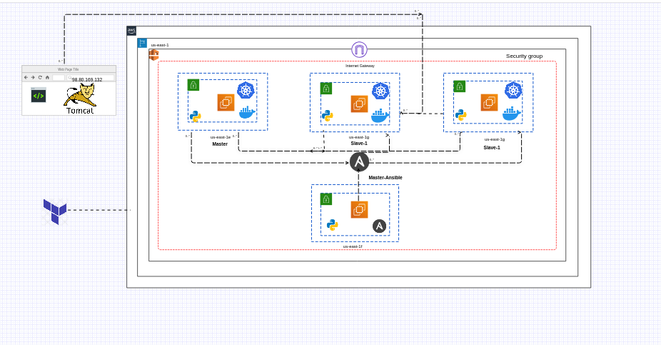

# Setup-a-kubernetes-dependencies-and-launch-a-tomcat-web-app-through-terraform-and-ansible
Establish a working environment for Kubernetes utilizing Terraform, install the necessary Kubernetes dependencies via an Ansible playbook, and deploy a Tomcat web application.

## **

# Architecture of this project...

